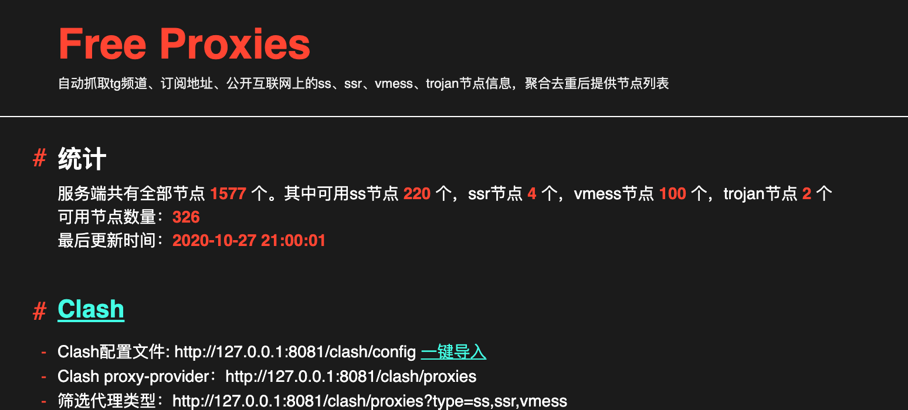
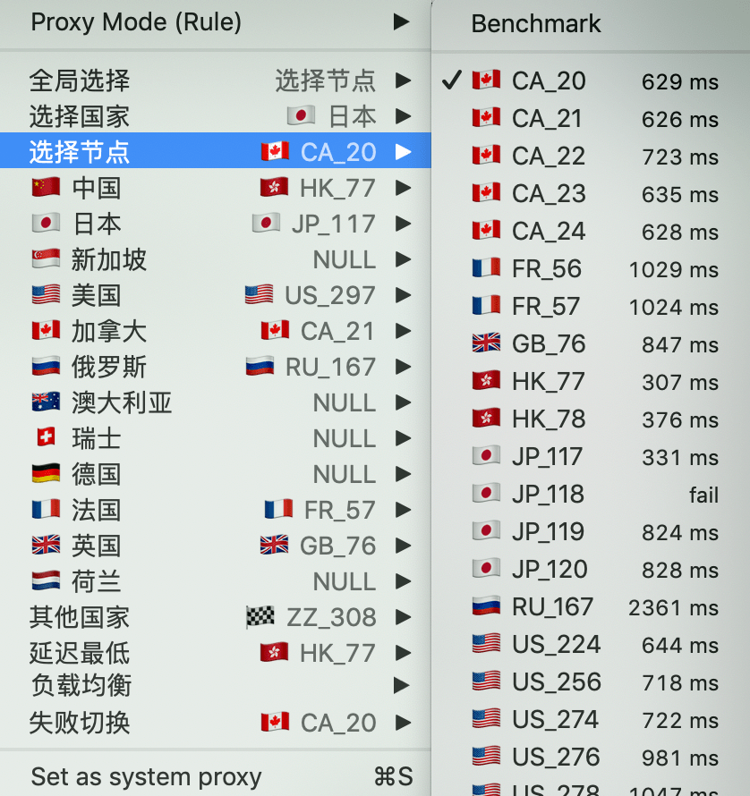

# Proxypool Health Check

## Info

This is proxy health check and provider part of proxypool. You should have had a
[proxypool](https://github.com/sansui233/proxypool) server available at first.

Due to the poor availability of proceeding node health check on servers overseas, The best usage of this project is to run on your own server within Mainland China.

## Install&Run

Choose either.

### 1. Use release version

Download from [releases](https://github.com/Sansui233/proxypoolCheck/releases)

Put config.yaml into directory and run. You can use -c to specify configuration path.

```shell
./proxypoolCheck
# or
./proxypoolCheck -c PathToConfig
```

### 2. Compile Source

Make sure golang installed. Then download source
```sh
$ go get -u -v github.com/Sansui233/proxypoolCheck
```

And run
```shell script
$ go run main.go -c ./config/config.yaml
```

## Configuration

Basic configuration.

```yaml
# proxypool remote server url. Blank for http://127.0.0.1:8080
server_url: https://example.proxypoolserver.com
# server_url: https://example.proxypoolserver.com/clash/proxies?type=vmess

# For your local server
request: http   # http / https
domain:         # default: 127.0.0.1
port:           # default: 80

speedtest:      # default false
connection:     # default 20
```

If your web server port is not the same as proxypoolCheck serving port, you should put web server port in configuration, and set an environment variable `PORT` for proxypoolCheck to serve. This will be really helpful when you are doing frp.

```
export PORT=ppcheckport
```

## 声明

本项目遵循 GNU General Public License v3.0 开源，在此基础上，所有使用本项目提供服务者都必须在网站首页保留指向本项目的链接

本项目仅限个人自己使用，**禁止使用本项目进行营利**和**做其他违法事情**，产生的一切后果本项目概不负责。

## Screenshots



